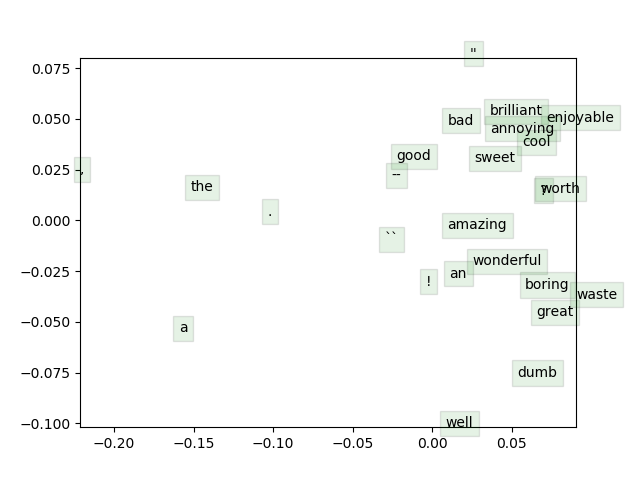
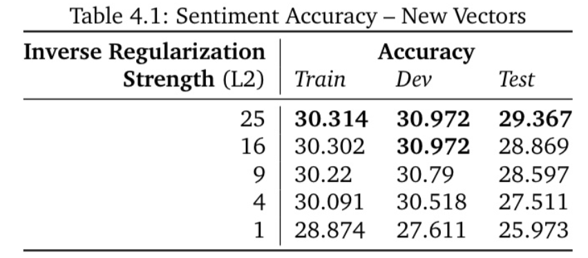
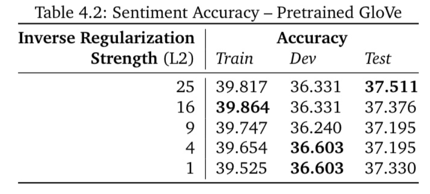
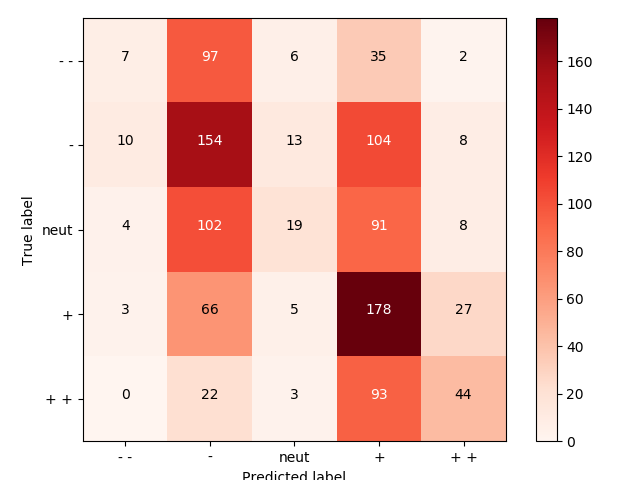
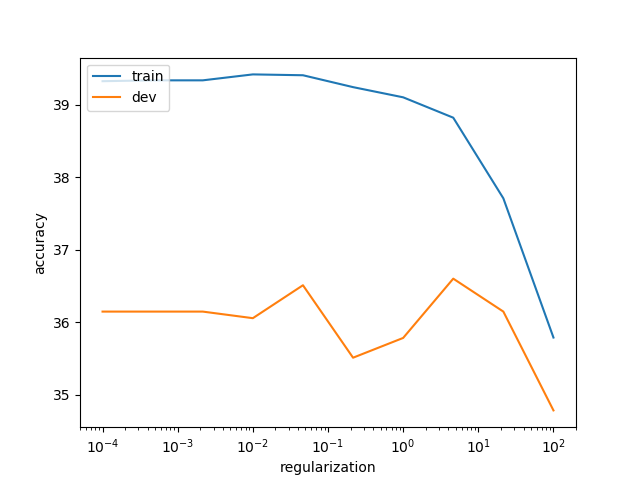
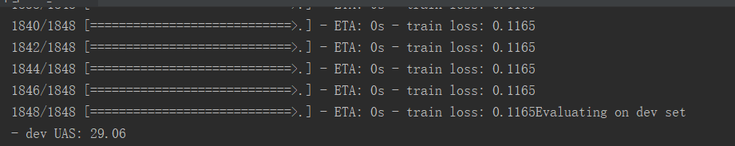

## 概述 
课程官网 http://web.stanford.edu/class/cs224n/syllabus.html

作业环境Python3.6  

作业版本2018年春季

## 作业进度
+ 2018/10/25	完成q1_softmax.py 
   
+ 2018/11/03  q1、q2所有内容

+ 2018/11/14  完成作业assignment1

+ 2018/11/20 完成作业assignment2

## assignment1备注
py3下因为编码问题需要额外修改utils文件中的**glove.py**和**treebank.py** ，另外在运行q3.run和q4之前需要运行数据下载脚本**get_datasets.sh** 。

#### 运行结果
1.词向量的可视化  
  
  

2.由自己训练的词向量做情感分析结果    

3.由glove训练的词向量做情感分析结果  

	后者更好的原因是：
	
		后者在维基上训练，数据量更大
	
		后者维度更高（50维）
	
		GloVe利用了全局统计信息，而word2vec（SG）没有  

4.生成的confusion matrix  

  

这个矩阵的主对角线上的元素越多，说明预测越正确。其他元素都是失误。可见模型很难分辨“中性”情感，并倾向于将其分入负面。但模型没有犯下大是大非的错误（将--分入++，或反之）。

5.惩罚因子对效果的影响  

## assignment2备注
有了assignment1的基础，完成assignment1还算顺利，也是越来体会到编程不是那么重要了，只要公式推导出来了，编程也就是水到渠成事情。
这里需要注意一下，在用py3运行q2_parser_model.py的过程中，q2_parser_transitions.py会报一个错，我查看了原因时因为当stack中只有一个root时，下一步的动作竟然时left-arc，这应该时model时predict错误了。但是我强行修改了动作使其只能shift后，训练过程在dev上的精度只有29.06，这就很郁闷了。  

